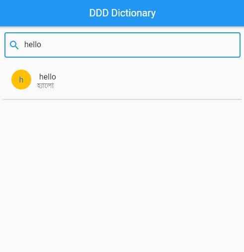

# DDD_Local_Json_Dictionary

Basic Dictionary App For Handaling Large JSON File

## Getting Started

This project is a starting point for a Flutter Local Json Dictionary App.

A few resources to get you started if this is your first Flutter project:

- [Lab: Write your first Flutter app](https://docs.flutter.dev/get-started/codelab)
- [Cookbook: Useful Flutter samples](https://docs.flutter.dev/cookbook)

Updated Flutter 2.10.2
## 🔗 Links

